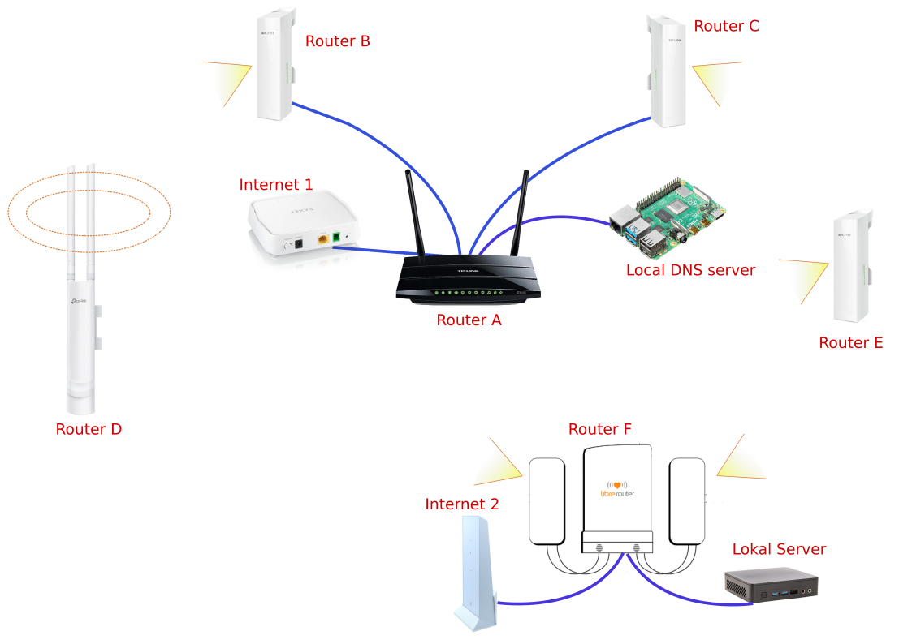

# Libremesh Test Bed - Network Profiles

## Overview

This repository contains network profiles designed for testing the new release of Libremesh 2024, which is based on OpenWrt 22.05.2 and supported by the Libremesh community. These profiles are intended for use in the Libremesh test bed environment.

## Compatibility

- Libremesh Version: 2024
- OpenWrt Version: 22.05.2

## Environment and physical connections

### Installation

## Router A

Hardware: TpLink wdr3500

Profile: indoor_omnidirectional_dualband

First ethernet: WAN connected to fiber modem (wan)

Second ethernet: mesh, connected to Router B (lan1)

Third ethernet: mesh, connected to Router C (lan2)

Fourth ethernet: client, local DNS server (lan3)

IP: 

MAC: 

## Router B

Hardware: TpLink Cpe510 v3

Profile: outdoor_sectorial_singleband

First ethernet: mesh, connected to PoE and to Router A (lan1)

IP: 

MAC: 

## Router C

Hardware: TpLink Cpe210 v2

Profile: outdoor_sectorial_singleband

First ethernet: mesh, connected to PoE and to Router A (lan1)

IP: 

MAC: 

## Router D

Hardware: TpLink Eap225 outdoor v3

Profile: outdoor_omnidirectional_dualband

First ethernet: unused, configured as default

IPv4: 

MAC: 

## Router E

Hardware: TpLink Cpe210 v2

Profile: outdoor_sectorial_singleband

First ethernet: unused, configurede as default

IP: 

MAC: 

## Router F

Hardware: Librerouter v1

Profile: librerouter

First ethernet: WAN connected to starlink router (wan)

Second ethernet: client, Lokal server (lan1)

IP: 

MAC: 

# Hardware

## Outdoor

## Indoor

# Profiles

